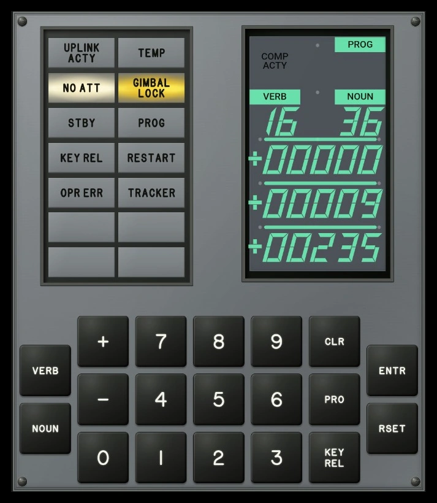
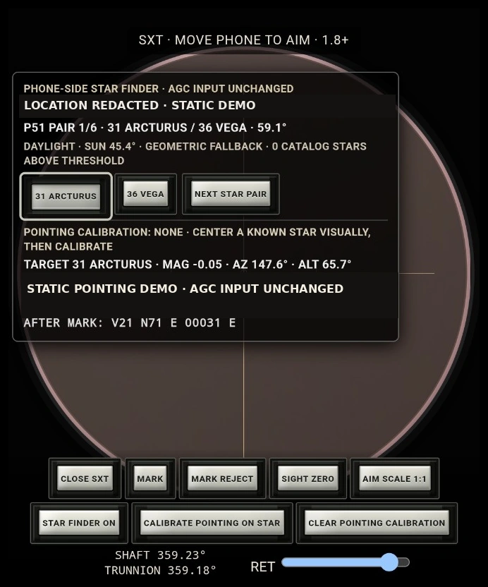
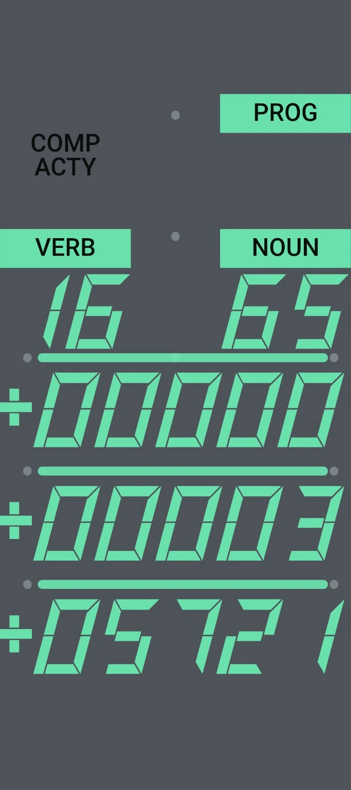

# AGC DSKY Android

Independent Apollo Guidance Computer / DSKY simulator for Android. It runs the real `yaAGC` WebAssembly core with the Apollo 11 Command Module **Comanche 055** rope and keeps the normal runtime offline.

> Not affiliated with, sponsored by, or endorsed by NASA or the United States Government. NASA names and mission references are used descriptively for historical identification.

## Screenshots

| Main DSKY | Sextant | EL-only display |
| --- | --- | --- |
|  |  |  |

The sextant screenshot shows the real app UI with a static demonstration pointing state; it does not contain a camera photograph.

## What it does

- Apollo Block II-style 19-key DSKY.
- Real `yaAGC` execution with pinned **Comanche 055**.
- Real AGC relay/channel-driven DSKY output, including `COMP ACTY`.
- Phone IMU / ICDU and PIPA input paths.
- Camera-based CM sextant interface with MARK / MARK REJECT and Apollo navigation-star helper.
- AGC state save/restore and runtime diagnostics.
- Synthetic relay-click audio.
- Android DreamService clock/screensaver.
- Resizable **EL-only** home-screen widget.
- No Android `INTERNET` permission in the packaged app.

## Build

Requirements: JDK 17, Node.js 18+, Android SDK 37 / Build Tools 36, and the pinned `vendor/webAGC` submodule.

```bash
git clone --recurse-submodules https://github.com/ryanbytes/AGC-DSKY-Android.git
cd AGC-DSKY-Android
bash tools/build-local.sh
```

The build verifies the pinned webAGC revision and packaged `yaAGC.wasm` / `Comanche055.bin` identities before packaging.

## Licensing and commercial distribution

The Android/frontend project is **GNU GPL version 2**. GPLv2 permits selling copies, but recipients retain the GPL rights to source, modification, and redistribution.

Commercial binary releases should publish the complete corresponding source snapshot for that binary and include the GPL and third-party notices. See [`docs/COMMERCIAL_RELEASE.md`](docs/COMMERCIAL_RELEASE.md).

The app includes an offline **LEGAL / SOURCE** screen with:

- the public corresponding-source location;
- the complete GPLv2 text;
- third-party notices and the Ben Krasnow MIT notice; and
- a NASA/U.S. Government non-endorsement statement.

See [`LICENSE`](LICENSE) and [`THIRD_PARTY.md`](THIRD_PARTY.md).

## Current commercial release

**Version 1.0** uses `release/1.0-commercial-1` as the fixed corresponding-source branch.
