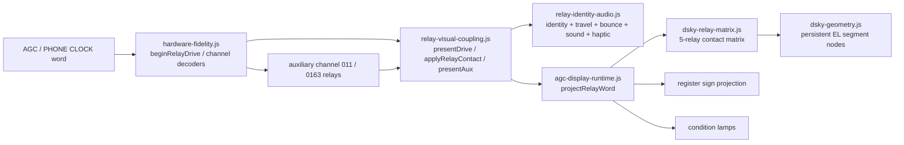

# DSKY relay-to-code map

Generated from the live `main` topology at commit `fdbf2ddbea7b90e25775395f5134693d36131ddc`.

This is a map of the **software relay identities currently modeled by the app**: **132 channel-10 row/bit identities** (12 rows × 11 bits) plus **8 auxiliary identities**, for **140 modeled identities total**.

> Important historical distinction: `docs/DSKY_RELAY_TIMING.md` cites the Apollo DSKY total as 120 latching + 12 non-latching relays. The runtime deliberately assigns a deterministic identity to every one of the 12 × 11 channel-10 low-bit positions, so this 140-entry software map is **not** a claim that the spacecraft contained 140 physical DSKY relays.

## Runtime flow

## Identity convention

`relay-identity-audio.js` defines:

- bit 0–4 → `D-K1` … `D-K5`
- bit 5–9 → `C-K1` … `C-K5`
- bit 10 → `B`
- identity → `ROW-rr:<label>`
- ordinal → `(row - 1) * 11 + bit`

Every latching identity gets its own deterministic manufacturing profile, contact trace, acoustic profile, and haptic timing in `relay-identity-audio.js`.

## Five-relay digit contact matrix

For both C and D five-relay banks, `dsky-relay-matrix.js::segmentsForRelayCode` uses the same contact logic:

| K relay | Contact effect in code |
|---|---|
| K1 | H → logical segment **b** |
| K2 | Selects K/e and M/c paths: reset makes e follow a and c follow f; set forces c on |
| K3 | F → **f** and participates in N/d logic |
| K4 | J → **g** and participates in N/d logic |
| K5 | E → **a**, gates e, and gates N → **d** |

The matrix then maps schematic E/H/M/N/K/F/J to app segments a/b/c/d/e/f/g.

## Route keys

- **DIGIT** — `hardware-fidelity.beginRelayDrive` → `relay-visual-coupling.presentDrive/applyRelayContact` → `AGCDSKY_DISPLAY.renderRelayWord` → `agc-display-runtime.projectRelayWord(case row)` → `dsky-relay-matrix.segmentsForRelayCode` → `dsky-geometry.paintApolloDigitSlot`.
- **SIGN** — `hardware-fidelity.beginRelayDrive` → `relay-visual-coupling.presentDrive/applyRelayContact` → `agc-display-runtime.projectRelayWord(case row)` → `renderReg` → `dsky-geometry.paintApolloSignSlot`.
- **COND** — `hardware-fidelity.beginRelayDrive` → relay presentation → `agc-display-runtime.projectRelayWord(case 12)` → `displayRenderer.setLamp(...)`.
- **MECH-ONLY** — Identity/timing/audio/haptic still run through `relay-identity-audio.js` + `relay-visual-coupling.js`; `projectRelayWord` intentionally has no visible consumer for this bit/bank.
- **AUX-LAMP** — Channel decoder in `hardware-fidelity.js` → `setAuxRelays` → `relay-visual-coupling.presentAux` → `commitAuxRelays` → `displayRenderer.setLamp(...)`.
- **AUX-FLASH** — Channel 0163 decoder → `setAuxRelays({flash})` → `relay-visual-coupling.presentAux` → `commitAuxRelays` → `document.body.classList.toggle('vn-flash-off', ...)`.

## Row-level destination summary

| Row | C bank | D bank | B bit | PHONE CLOCK use |
|---:|---|---|---|---|
| 1 | R3 digit 4 (index 3) | R3 digit 5 (index 4) | R3 MINUS sign | R3 seconds pair: digits 4–5; B held 0 |
| 2 | R3 digit 2 (index 1) | R3 digit 3 (index 2) | R3 PLUS sign | R3 seconds pair: digits 2–3; B held 1 |
| 3 | R2 digit 5 (index 4) | R3 digit 1 (index 0) | Unrendered / mechanically modeled | Minute/seconds bridge: R2 digit 5 + R3 digit 1; B held 0 |
| 4 | R2 digit 3 (index 2) | R2 digit 4 (index 3) | R2 MINUS sign | R2 minutes pair: digits 3–4; B held 0 |
| 5 | R2 digit 1 (index 0) | R2 digit 2 (index 1) | R2 PLUS sign | R2 minutes pair: digits 1–2; B held 1 |
| 6 | R1 digit 4 (index 3) | R1 digit 5 (index 4) | R1 MINUS sign | R1 hours pair: digits 4–5; B held 0 |
| 7 | R1 digit 2 (index 1) | R1 digit 3 (index 2) | R1 PLUS sign | R1 hours pair: digits 2–3; B held 1 |
| 8 | Visually unconnected C digit bank | R1 digit 1 (index 0) | Unrendered / mechanically modeled | R1 hour leading digit uses D bank only; C bank still modeled physically |
| 9 | NOUN left digit | NOUN right digit | Unrendered / mechanically modeled | Not in CLOCK_GROUPS; clock face keeps NOUN at seeded/held state |
| 10 | VERB left digit | VERB right digit | Unrendered / mechanically modeled | Not in CLOCK_GROUPS; clock face keeps VERB at seeded/held state |
| 11 | PROG left digit | PROG right digit | Unrendered / mechanically modeled | Not in CLOCK_GROUPS; clock face keeps PROG at seeded/held state |
| 12 | direct condition/discrete bits, not a digit bank | direct condition/discrete bits, not a digit bank | direct/reserved bit | not in CLOCK_GROUPS |

## All 132 channel-10 modeled relay identities

| Ord | Relay ID | Row | Bit | Mask | Bank/K | Visible destination | Contact / function | Route |
|---:|---|---:|---:|---:|---|---|---|---|
| 0 | `ROW-01:D-K1` | 1 | 0 | `0o0001` | D-K1 | R3 digit 5 (index 4) | K1: directly controls H → segment b | DIGIT |
| 1 | `ROW-01:D-K2` | 1 | 1 | `0o0002` | D-K2 | R3 digit 5 (index 4) | K2: contact logic selects K/e and M/c paths | DIGIT |
| 2 | `ROW-01:D-K3` | 1 | 2 | `0o0004` | D-K3 | R3 digit 5 (index 4) | K3: drives F → f and participates in N/d logic | DIGIT |
| 3 | `ROW-01:D-K4` | 1 | 3 | `0o0010` | D-K4 | R3 digit 5 (index 4) | K4: drives J → g and participates in N/d logic | DIGIT |
| 4 | `ROW-01:D-K5` | 1 | 4 | `0o0020` | D-K5 | R3 digit 5 (index 4) | K5: drives E → a and gates K/e + N/d paths | DIGIT |
| 5 | `ROW-01:C-K1` | 1 | 5 | `0o0040` | C-K1 | R3 digit 4 (index 3) | K1: directly controls H → segment b | DIGIT |
| 6 | `ROW-01:C-K2` | 1 | 6 | `0o0100` | C-K2 | R3 digit 4 (index 3) | K2: contact logic selects K/e and M/c paths | DIGIT |
| 7 | `ROW-01:C-K3` | 1 | 7 | `0o0200` | C-K3 | R3 digit 4 (index 3) | K3: drives F → f and participates in N/d logic | DIGIT |
| 8 | `ROW-01:C-K4` | 1 | 8 | `0o0400` | C-K4 | R3 digit 4 (index 3) | K4: drives J → g and participates in N/d logic | DIGIT |
| 9 | `ROW-01:C-K5` | 1 | 9 | `0o1000` | C-K5 | R3 digit 4 (index 3) | K5: drives E → a and gates K/e + N/d paths | DIGIT |
| 10 | `ROW-01:B` | 1 | 10 | `0o2000` | B | R3 MINUS sign | B relay is projected as the register sign latch for this row. | SIGN |
| 11 | `ROW-02:D-K1` | 2 | 0 | `0o0001` | D-K1 | R3 digit 3 (index 2) | K1: directly controls H → segment b | DIGIT |
| 12 | `ROW-02:D-K2` | 2 | 1 | `0o0002` | D-K2 | R3 digit 3 (index 2) | K2: contact logic selects K/e and M/c paths | DIGIT |
| 13 | `ROW-02:D-K3` | 2 | 2 | `0o0004` | D-K3 | R3 digit 3 (index 2) | K3: drives F → f and participates in N/d logic | DIGIT |
| 14 | `ROW-02:D-K4` | 2 | 3 | `0o0010` | D-K4 | R3 digit 3 (index 2) | K4: drives J → g and participates in N/d logic | DIGIT |
| 15 | `ROW-02:D-K5` | 2 | 4 | `0o0020` | D-K5 | R3 digit 3 (index 2) | K5: drives E → a and gates K/e + N/d paths | DIGIT |
| 16 | `ROW-02:C-K1` | 2 | 5 | `0o0040` | C-K1 | R3 digit 2 (index 1) | K1: directly controls H → segment b | DIGIT |
| 17 | `ROW-02:C-K2` | 2 | 6 | `0o0100` | C-K2 | R3 digit 2 (index 1) | K2: contact logic selects K/e and M/c paths | DIGIT |
| 18 | `ROW-02:C-K3` | 2 | 7 | `0o0200` | C-K3 | R3 digit 2 (index 1) | K3: drives F → f and participates in N/d logic | DIGIT |
| 19 | `ROW-02:C-K4` | 2 | 8 | `0o0400` | C-K4 | R3 digit 2 (index 1) | K4: drives J → g and participates in N/d logic | DIGIT |
| 20 | `ROW-02:C-K5` | 2 | 9 | `0o1000` | C-K5 | R3 digit 2 (index 1) | K5: drives E → a and gates K/e + N/d paths | DIGIT |
| 21 | `ROW-02:B` | 2 | 10 | `0o2000` | B | R3 PLUS sign | B relay is projected as the register sign latch for this row. | SIGN |
| 22 | `ROW-03:D-K1` | 3 | 0 | `0o0001` | D-K1 | R3 digit 1 (index 0) | K1: directly controls H → segment b | DIGIT |
| 23 | `ROW-03:D-K2` | 3 | 1 | `0o0002` | D-K2 | R3 digit 1 (index 0) | K2: contact logic selects K/e and M/c paths | DIGIT |
| 24 | `ROW-03:D-K3` | 3 | 2 | `0o0004` | D-K3 | R3 digit 1 (index 0) | K3: drives F → f and participates in N/d logic | DIGIT |
| 25 | `ROW-03:D-K4` | 3 | 3 | `0o0010` | D-K4 | R3 digit 1 (index 0) | K4: drives J → g and participates in N/d logic | DIGIT |
| 26 | `ROW-03:D-K5` | 3 | 4 | `0o0020` | D-K5 | R3 digit 1 (index 0) | K5: drives E → a and gates K/e + N/d paths | DIGIT |
| 27 | `ROW-03:C-K1` | 3 | 5 | `0o0040` | C-K1 | R2 digit 5 (index 4) | K1: directly controls H → segment b | DIGIT |
| 28 | `ROW-03:C-K2` | 3 | 6 | `0o0100` | C-K2 | R2 digit 5 (index 4) | K2: contact logic selects K/e and M/c paths | DIGIT |
| 29 | `ROW-03:C-K3` | 3 | 7 | `0o0200` | C-K3 | R2 digit 5 (index 4) | K3: drives F → f and participates in N/d logic | DIGIT |
| 30 | `ROW-03:C-K4` | 3 | 8 | `0o0400` | C-K4 | R2 digit 5 (index 4) | K4: drives J → g and participates in N/d logic | DIGIT |
| 31 | `ROW-03:C-K5` | 3 | 9 | `0o1000` | C-K5 | R2 digit 5 (index 4) | K5: drives E → a and gates K/e + N/d paths | DIGIT |
| 32 | `ROW-03:B` | 3 | 10 | `0o2000` | B | Unrendered / mechanically modeled | B relay is mechanically modeled but this row's display projection ignores it. | MECH-ONLY |
| 33 | `ROW-04:D-K1` | 4 | 0 | `0o0001` | D-K1 | R2 digit 4 (index 3) | K1: directly controls H → segment b | DIGIT |
| 34 | `ROW-04:D-K2` | 4 | 1 | `0o0002` | D-K2 | R2 digit 4 (index 3) | K2: contact logic selects K/e and M/c paths | DIGIT |
| 35 | `ROW-04:D-K3` | 4 | 2 | `0o0004` | D-K3 | R2 digit 4 (index 3) | K3: drives F → f and participates in N/d logic | DIGIT |
| 36 | `ROW-04:D-K4` | 4 | 3 | `0o0010` | D-K4 | R2 digit 4 (index 3) | K4: drives J → g and participates in N/d logic | DIGIT |
| 37 | `ROW-04:D-K5` | 4 | 4 | `0o0020` | D-K5 | R2 digit 4 (index 3) | K5: drives E → a and gates K/e + N/d paths | DIGIT |
| 38 | `ROW-04:C-K1` | 4 | 5 | `0o0040` | C-K1 | R2 digit 3 (index 2) | K1: directly controls H → segment b | DIGIT |
| 39 | `ROW-04:C-K2` | 4 | 6 | `0o0100` | C-K2 | R2 digit 3 (index 2) | K2: contact logic selects K/e and M/c paths | DIGIT |
| 40 | `ROW-04:C-K3` | 4 | 7 | `0o0200` | C-K3 | R2 digit 3 (index 2) | K3: drives F → f and participates in N/d logic | DIGIT |
| 41 | `ROW-04:C-K4` | 4 | 8 | `0o0400` | C-K4 | R2 digit 3 (index 2) | K4: drives J → g and participates in N/d logic | DIGIT |
| 42 | `ROW-04:C-K5` | 4 | 9 | `0o1000` | C-K5 | R2 digit 3 (index 2) | K5: drives E → a and gates K/e + N/d paths | DIGIT |
| 43 | `ROW-04:B` | 4 | 10 | `0o2000` | B | R2 MINUS sign | B relay is projected as the register sign latch for this row. | SIGN |
| 44 | `ROW-05:D-K1` | 5 | 0 | `0o0001` | D-K1 | R2 digit 2 (index 1) | K1: directly controls H → segment b | DIGIT |
| 45 | `ROW-05:D-K2` | 5 | 1 | `0o0002` | D-K2 | R2 digit 2 (index 1) | K2: contact logic selects K/e and M/c paths | DIGIT |
| 46 | `ROW-05:D-K3` | 5 | 2 | `0o0004` | D-K3 | R2 digit 2 (index 1) | K3: drives F → f and participates in N/d logic | DIGIT |
| 47 | `ROW-05:D-K4` | 5 | 3 | `0o0010` | D-K4 | R2 digit 2 (index 1) | K4: drives J → g and participates in N/d logic | DIGIT |
| 48 | `ROW-05:D-K5` | 5 | 4 | `0o0020` | D-K5 | R2 digit 2 (index 1) | K5: drives E → a and gates K/e + N/d paths | DIGIT |
| 49 | `ROW-05:C-K1` | 5 | 5 | `0o0040` | C-K1 | R2 digit 1 (index 0) | K1: directly controls H → segment b | DIGIT |
| 50 | `ROW-05:C-K2` | 5 | 6 | `0o0100` | C-K2 | R2 digit 1 (index 0) | K2: contact logic selects K/e and M/c paths | DIGIT |
| 51 | `ROW-05:C-K3` | 5 | 7 | `0o0200` | C-K3 | R2 digit 1 (index 0) | K3: drives F → f and participates in N/d logic | DIGIT |
| 52 | `ROW-05:C-K4` | 5 | 8 | `0o0400` | C-K4 | R2 digit 1 (index 0) | K4: drives J → g and participates in N/d logic | DIGIT |
| 53 | `ROW-05:C-K5` | 5 | 9 | `0o1000` | C-K5 | R2 digit 1 (index 0) | K5: drives E → a and gates K/e + N/d paths | DIGIT |
| 54 | `ROW-05:B` | 5 | 10 | `0o2000` | B | R2 PLUS sign | B relay is projected as the register sign latch for this row. | SIGN |
| 55 | `ROW-06:D-K1` | 6 | 0 | `0o0001` | D-K1 | R1 digit 5 (index 4) | K1: directly controls H → segment b | DIGIT |
| 56 | `ROW-06:D-K2` | 6 | 1 | `0o0002` | D-K2 | R1 digit 5 (index 4) | K2: contact logic selects K/e and M/c paths | DIGIT |
| 57 | `ROW-06:D-K3` | 6 | 2 | `0o0004` | D-K3 | R1 digit 5 (index 4) | K3: drives F → f and participates in N/d logic | DIGIT |
| 58 | `ROW-06:D-K4` | 6 | 3 | `0o0010` | D-K4 | R1 digit 5 (index 4) | K4: drives J → g and participates in N/d logic | DIGIT |
| 59 | `ROW-06:D-K5` | 6 | 4 | `0o0020` | D-K5 | R1 digit 5 (index 4) | K5: drives E → a and gates K/e + N/d paths | DIGIT |
| 60 | `ROW-06:C-K1` | 6 | 5 | `0o0040` | C-K1 | R1 digit 4 (index 3) | K1: directly controls H → segment b | DIGIT |
| 61 | `ROW-06:C-K2` | 6 | 6 | `0o0100` | C-K2 | R1 digit 4 (index 3) | K2: contact logic selects K/e and M/c paths | DIGIT |
| 62 | `ROW-06:C-K3` | 6 | 7 | `0o0200` | C-K3 | R1 digit 4 (index 3) | K3: drives F → f and participates in N/d logic | DIGIT |
| 63 | `ROW-06:C-K4` | 6 | 8 | `0o0400` | C-K4 | R1 digit 4 (index 3) | K4: drives J → g and participates in N/d logic | DIGIT |
| 64 | `ROW-06:C-K5` | 6 | 9 | `0o1000` | C-K5 | R1 digit 4 (index 3) | K5: drives E → a and gates K/e + N/d paths | DIGIT |
| 65 | `ROW-06:B` | 6 | 10 | `0o2000` | B | R1 MINUS sign | B relay is projected as the register sign latch for this row. | SIGN |
| 66 | `ROW-07:D-K1` | 7 | 0 | `0o0001` | D-K1 | R1 digit 3 (index 2) | K1: directly controls H → segment b | DIGIT |
| 67 | `ROW-07:D-K2` | 7 | 1 | `0o0002` | D-K2 | R1 digit 3 (index 2) | K2: contact logic selects K/e and M/c paths | DIGIT |
| 68 | `ROW-07:D-K3` | 7 | 2 | `0o0004` | D-K3 | R1 digit 3 (index 2) | K3: drives F → f and participates in N/d logic | DIGIT |
| 69 | `ROW-07:D-K4` | 7 | 3 | `0o0010` | D-K4 | R1 digit 3 (index 2) | K4: drives J → g and participates in N/d logic | DIGIT |
| 70 | `ROW-07:D-K5` | 7 | 4 | `0o0020` | D-K5 | R1 digit 3 (index 2) | K5: drives E → a and gates K/e + N/d paths | DIGIT |
| 71 | `ROW-07:C-K1` | 7 | 5 | `0o0040` | C-K1 | R1 digit 2 (index 1) | K1: directly controls H → segment b | DIGIT |
| 72 | `ROW-07:C-K2` | 7 | 6 | `0o0100` | C-K2 | R1 digit 2 (index 1) | K2: contact logic selects K/e and M/c paths | DIGIT |
| 73 | `ROW-07:C-K3` | 7 | 7 | `0o0200` | C-K3 | R1 digit 2 (index 1) | K3: drives F → f and participates in N/d logic | DIGIT |
| 74 | `ROW-07:C-K4` | 7 | 8 | `0o0400` | C-K4 | R1 digit 2 (index 1) | K4: drives J → g and participates in N/d logic | DIGIT |
| 75 | `ROW-07:C-K5` | 7 | 9 | `0o1000` | C-K5 | R1 digit 2 (index 1) | K5: drives E → a and gates K/e + N/d paths | DIGIT |
| 76 | `ROW-07:B` | 7 | 10 | `0o2000` | B | R1 PLUS sign | B relay is projected as the register sign latch for this row. | SIGN |
| 77 | `ROW-08:D-K1` | 8 | 0 | `0o0001` | D-K1 | R1 digit 1 (index 0) | K1: directly controls H → segment b | DIGIT |
| 78 | `ROW-08:D-K2` | 8 | 1 | `0o0002` | D-K2 | R1 digit 1 (index 0) | K2: contact logic selects K/e and M/c paths | DIGIT |
| 79 | `ROW-08:D-K3` | 8 | 2 | `0o0004` | D-K3 | R1 digit 1 (index 0) | K3: drives F → f and participates in N/d logic | DIGIT |
| 80 | `ROW-08:D-K4` | 8 | 3 | `0o0010` | D-K4 | R1 digit 1 (index 0) | K4: drives J → g and participates in N/d logic | DIGIT |
| 81 | `ROW-08:D-K5` | 8 | 4 | `0o0020` | D-K5 | R1 digit 1 (index 0) | K5: drives E → a and gates K/e + N/d paths | DIGIT |
| 82 | `ROW-08:C-K1` | 8 | 5 | `0o0040` | C-K1 | Visually unconnected C digit bank | K1: directly controls H → segment b | MECH-ONLY |
| 83 | `ROW-08:C-K2` | 8 | 6 | `0o0100` | C-K2 | Visually unconnected C digit bank | K2: contact logic selects K/e and M/c paths | MECH-ONLY |
| 84 | `ROW-08:C-K3` | 8 | 7 | `0o0200` | C-K3 | Visually unconnected C digit bank | K3: drives F → f and participates in N/d logic | MECH-ONLY |
| 85 | `ROW-08:C-K4` | 8 | 8 | `0o0400` | C-K4 | Visually unconnected C digit bank | K4: drives J → g and participates in N/d logic | MECH-ONLY |
| 86 | `ROW-08:C-K5` | 8 | 9 | `0o1000` | C-K5 | Visually unconnected C digit bank | K5: drives E → a and gates K/e + N/d paths | MECH-ONLY |
| 87 | `ROW-08:B` | 8 | 10 | `0o2000` | B | Unrendered / mechanically modeled | B relay is mechanically modeled but this row's display projection ignores it. | MECH-ONLY |
| 88 | `ROW-09:D-K1` | 9 | 0 | `0o0001` | D-K1 | NOUN right digit | K1: directly controls H → segment b | DIGIT |
| 89 | `ROW-09:D-K2` | 9 | 1 | `0o0002` | D-K2 | NOUN right digit | K2: contact logic selects K/e and M/c paths | DIGIT |
| 90 | `ROW-09:D-K3` | 9 | 2 | `0o0004` | D-K3 | NOUN right digit | K3: drives F → f and participates in N/d logic | DIGIT |
| 91 | `ROW-09:D-K4` | 9 | 3 | `0o0010` | D-K4 | NOUN right digit | K4: drives J → g and participates in N/d logic | DIGIT |
| 92 | `ROW-09:D-K5` | 9 | 4 | `0o0020` | D-K5 | NOUN right digit | K5: drives E → a and gates K/e + N/d paths | DIGIT |
| 93 | `ROW-09:C-K1` | 9 | 5 | `0o0040` | C-K1 | NOUN left digit | K1: directly controls H → segment b | DIGIT |
| 94 | `ROW-09:C-K2` | 9 | 6 | `0o0100` | C-K2 | NOUN left digit | K2: contact logic selects K/e and M/c paths | DIGIT |
| 95 | `ROW-09:C-K3` | 9 | 7 | `0o0200` | C-K3 | NOUN left digit | K3: drives F → f and participates in N/d logic | DIGIT |
| 96 | `ROW-09:C-K4` | 9 | 8 | `0o0400` | C-K4 | NOUN left digit | K4: drives J → g and participates in N/d logic | DIGIT |
| 97 | `ROW-09:C-K5` | 9 | 9 | `0o1000` | C-K5 | NOUN left digit | K5: drives E → a and gates K/e + N/d paths | DIGIT |
| 98 | `ROW-09:B` | 9 | 10 | `0o2000` | B | Unrendered / mechanically modeled | B relay is mechanically modeled but this row's display projection ignores it. | MECH-ONLY |
| 99 | `ROW-10:D-K1` | 10 | 0 | `0o0001` | D-K1 | VERB right digit | K1: directly controls H → segment b | DIGIT |
| 100 | `ROW-10:D-K2` | 10 | 1 | `0o0002` | D-K2 | VERB right digit | K2: contact logic selects K/e and M/c paths | DIGIT |
| 101 | `ROW-10:D-K3` | 10 | 2 | `0o0004` | D-K3 | VERB right digit | K3: drives F → f and participates in N/d logic | DIGIT |
| 102 | `ROW-10:D-K4` | 10 | 3 | `0o0010` | D-K4 | VERB right digit | K4: drives J → g and participates in N/d logic | DIGIT |
| 103 | `ROW-10:D-K5` | 10 | 4 | `0o0020` | D-K5 | VERB right digit | K5: drives E → a and gates K/e + N/d paths | DIGIT |
| 104 | `ROW-10:C-K1` | 10 | 5 | `0o0040` | C-K1 | VERB left digit | K1: directly controls H → segment b | DIGIT |
| 105 | `ROW-10:C-K2` | 10 | 6 | `0o0100` | C-K2 | VERB left digit | K2: contact logic selects K/e and M/c paths | DIGIT |
| 106 | `ROW-10:C-K3` | 10 | 7 | `0o0200` | C-K3 | VERB left digit | K3: drives F → f and participates in N/d logic | DIGIT |
| 107 | `ROW-10:C-K4` | 10 | 8 | `0o0400` | C-K4 | VERB left digit | K4: drives J → g and participates in N/d logic | DIGIT |
| 108 | `ROW-10:C-K5` | 10 | 9 | `0o1000` | C-K5 | VERB left digit | K5: drives E → a and gates K/e + N/d paths | DIGIT |
| 109 | `ROW-10:B` | 10 | 10 | `0o2000` | B | Unrendered / mechanically modeled | B relay is mechanically modeled but this row's display projection ignores it. | MECH-ONLY |
| 110 | `ROW-11:D-K1` | 11 | 0 | `0o0001` | D-K1 | PROG right digit | K1: directly controls H → segment b | DIGIT |
| 111 | `ROW-11:D-K2` | 11 | 1 | `0o0002` | D-K2 | PROG right digit | K2: contact logic selects K/e and M/c paths | DIGIT |
| 112 | `ROW-11:D-K3` | 11 | 2 | `0o0004` | D-K3 | PROG right digit | K3: drives F → f and participates in N/d logic | DIGIT |
| 113 | `ROW-11:D-K4` | 11 | 3 | `0o0010` | D-K4 | PROG right digit | K4: drives J → g and participates in N/d logic | DIGIT |
| 114 | `ROW-11:D-K5` | 11 | 4 | `0o0020` | D-K5 | PROG right digit | K5: drives E → a and gates K/e + N/d paths | DIGIT |
| 115 | `ROW-11:C-K1` | 11 | 5 | `0o0040` | C-K1 | PROG left digit | K1: directly controls H → segment b | DIGIT |
| 116 | `ROW-11:C-K2` | 11 | 6 | `0o0100` | C-K2 | PROG left digit | K2: contact logic selects K/e and M/c paths | DIGIT |
| 117 | `ROW-11:C-K3` | 11 | 7 | `0o0200` | C-K3 | PROG left digit | K3: drives F → f and participates in N/d logic | DIGIT |
| 118 | `ROW-11:C-K4` | 11 | 8 | `0o0400` | C-K4 | PROG left digit | K4: drives J → g and participates in N/d logic | DIGIT |
| 119 | `ROW-11:C-K5` | 11 | 9 | `0o1000` | C-K5 | PROG left digit | K5: drives E → a and gates K/e + N/d paths | DIGIT |
| 120 | `ROW-11:B` | 11 | 10 | `0o2000` | B | Unrendered / mechanically modeled | B relay is mechanically modeled but this row's display projection ignores it. | MECH-ONLY |
| 121 | `ROW-12:D-K1` | 12 | 0 | `0o0001` | D-K1 | Unrendered / reserved in current CM projection | Row 12 is projected as direct condition/discrete bits; generic C/D/B identity label is only the software identity convention. | MECH-ONLY |
| 122 | `ROW-12:D-K2` | 12 | 1 | `0o0002` | D-K2 | Unrendered / reserved in current CM projection | Row 12 is projected as direct condition/discrete bits; generic C/D/B identity label is only the software identity convention. | MECH-ONLY |
| 123 | `ROW-12:D-K3` | 12 | 2 | `0o0004` | D-K3 | VEL condition lamp | Row 12 is projected as direct condition/discrete bits; generic C/D/B identity label is only the software identity convention. | COND |
| 124 | `ROW-12:D-K4` | 12 | 3 | `0o0010` | D-K4 | NO ATT condition lamp | Row 12 is projected as direct condition/discrete bits; generic C/D/B identity label is only the software identity convention. | COND |
| 125 | `ROW-12:D-K5` | 12 | 4 | `0o0020` | D-K5 | ALT condition lamp | Row 12 is projected as direct condition/discrete bits; generic C/D/B identity label is only the software identity convention. | COND |
| 126 | `ROW-12:C-K1` | 12 | 5 | `0o0040` | C-K1 | GIMBAL LOCK condition lamp | Row 12 is projected as direct condition/discrete bits; generic C/D/B identity label is only the software identity convention. | COND |
| 127 | `ROW-12:C-K2` | 12 | 6 | `0o0100` | C-K2 | Unrendered / reserved in current CM projection | Row 12 is projected as direct condition/discrete bits; generic C/D/B identity label is only the software identity convention. | MECH-ONLY |
| 128 | `ROW-12:C-K3` | 12 | 7 | `0o0200` | C-K3 | TRACKER condition lamp | Row 12 is projected as direct condition/discrete bits; generic C/D/B identity label is only the software identity convention. | COND |
| 129 | `ROW-12:C-K4` | 12 | 8 | `0o0400` | C-K4 | PROG condition lamp | Row 12 is projected as direct condition/discrete bits; generic C/D/B identity label is only the software identity convention. | COND |
| 130 | `ROW-12:C-K5` | 12 | 9 | `0o1000` | C-K5 | Unrendered / reserved in current CM projection | Row 12 is projected as direct condition/discrete bits; generic C/D/B identity label is only the software identity convention. | MECH-ONLY |
| 131 | `ROW-12:B` | 12 | 10 | `0o2000` | B | Unrendered / reserved in current CM projection | Row 12 is projected as direct condition/discrete bits; generic C/D/B identity label is only the software identity convention. | MECH-ONLY |

## All 8 auxiliary modeled relay identities

| Ord | Relay ID | Source | Mask | Destination | Route |
|---:|---|---|---:|---|---|
| 132 | `AUX:COMP-ACTY` | channel `0o011` | `0o00002` | COMP ACTY lamp | AUX-LAMP |
| 133 | `AUX:UPLINK-ACTY` | channel `0o011` | `0o00004` | UPLINK ACTY lamp | AUX-LAMP |
| 134 | `AUX:TEMP` | channel `0o163` | `0o00010` | TEMP lamp | AUX-LAMP |
| 135 | `AUX:KEY-REL` | channel `0o163` | `0o00020` | KEY REL lamp | AUX-LAMP |
| 136 | `AUX:OPR-ERR` | channel `0o163` | `0o00100` | OPR ERR lamp | AUX-LAMP |
| 137 | `AUX:FLASH` | channel `0o163` | `0o00040` | VERB/NOUN flash blanking contact (`vn-flash-off`) | AUX-FLASH |
| 138 | `AUX:RESTART` | channel `0o163` | `0o00200` | RESTART lamp | AUX-LAMP |
| 139 | `AUX:STBY` | channel `0o163` | `0o00400` | STBY lamp | AUX-LAMP |

## Source ownership by file

| File | Relay responsibility |
|---|---|
| `app/src/main/assets/relay-identity-audio.js` | Creates all 132 row/bit identities and 8 AUX identities; deterministic travel, settle, bounce, sound and haptic profiles. |
| `app/src/main/assets/hardware-fidelity.js` | Owns the 20 ms relay drive/latch boundary, channel-10 latches, CLOCK relay queue, and channel 011/0163 auxiliary relay requests. |
| `app/src/main/assets/relay-visual-coupling.js` | Converts each changing bit into per-relay armature/bounce/settle events; couples physical contact event to sound/haptic and optional display paint. |
| `app/src/main/assets/agc-display-runtime.js` | Maps row low-11 words to PROG/VERB/NOUN, R1/R2/R3 digits/signs, and row-12 condition lamps. |
| `app/src/main/assets/dsky-relay-matrix.js` | Converts a five-relay K1…K5 state into the seven EL segments. |
| `app/src/main/assets/dsky-geometry.js` | Applies the resulting digit/sign state to persistent EL SVG segment nodes. |
| `app/src/main/assets/phone-clock-runtime.js` | Defines CLOCK_GROUPS: which channel-10 row/bank feeds each clock digit and sign. |
| `app/src/main/assets/dsky-display-renderer.js` | Base stable EL renderer and lamp setters used beneath the Apollo geometry layer. |

## Key special cases

- **ROW-08 C-K1…C-K5** are modeled and can move/click, but the C field is visually unconnected; row 8 only renders the D bank to R1 digit 1.
- **Rows 9–11 B** are modeled but ignored by the visible PROG/VERB/NOUN projection.
- **ROW-03 B** is modeled but ignored; row 3 bridges R2 digit 5 and R3 digit 1.
- **Row 12** uses the generic row/bit identity naming but is projected as condition/discrete outputs, not two five-relay numeric banks.
- In **PHONE CLOCK**, physical relay motion/sound/haptics still run, but transient relay contact words are not allowed to paint the EL display; the settled clock digit state owns visible R1/R2/R3 rendering.
- The **FLASH** auxiliary identity is the physical visual blanking contact driven by channel 0163; channel 011 only carries the AGC flash request upstream.

## Machine-readable companion

See `docs/relay-code-map.json` for the same 140 identities plus route definitions.
